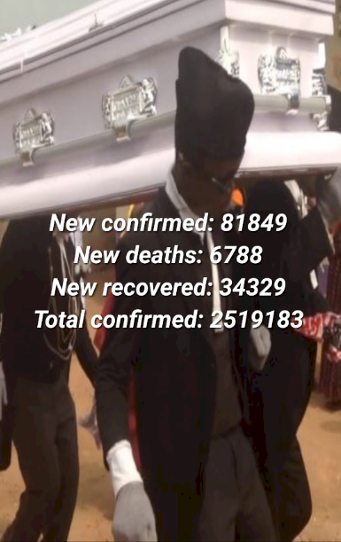

# CovidMonitoring
This application allows you to find out General data on the current situation with the spread of coronavirus infection in the world and in some countries in particular.

This application was created by the rule of one activity.

The following technologies are used:

-retrofit.2

-json

-restful api

-multithreading

